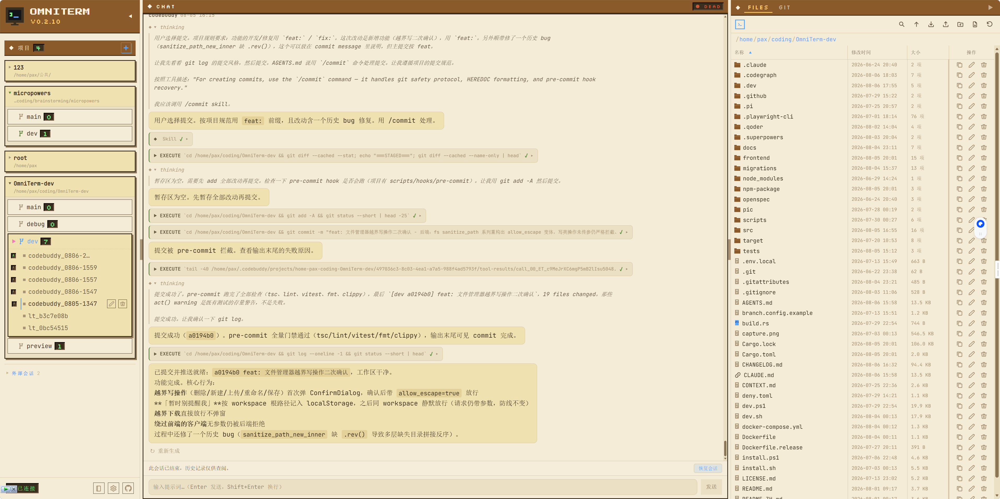
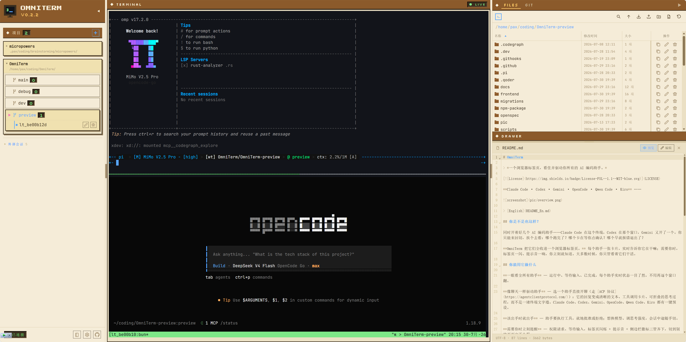
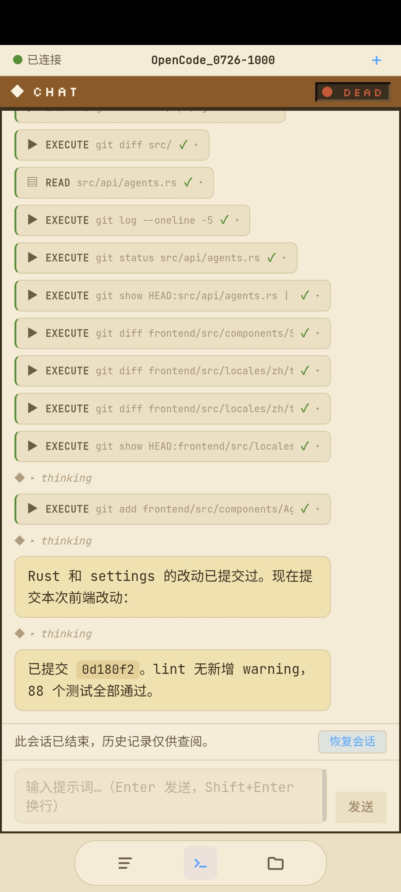

# OmniTerm

> *一个浏览器标签页，管住你手下所有的 AI 编码助手。*

[](LICENSE)

**Claude Code · Codex · Gemini · OpenCode · Qwen Code · Kiro** ……

<p align="center">
  
  
</p>
<p align="center">
  
</p>

> [English](README.md)

## 你是不是也这样？

同时开着好几个 AI 编码助手——Claude Code 在这个终端，Codex 在那个窗口，Gemini 又占了一个。你只能来回切换、挨个盯：哪个跑完了？哪个卡在等你点确认？哪个早就报错退出了？

**OmniTerm 把它们全收进一个浏览器标签页。** 每个助手一张卡片，干到哪一步实时可见；需要你的时候，标签页一闪、提示音一响，你马上就知道。大多数时候，你只需要看着它们干活。

## 它能帮你做什么

**所有助手尽收眼底** — 谁在跑、谁在等你、谁已经干完，状态实时更新，再也不用一个窗口一个窗口地翻。

**像聊天一样指挥助手** — 选中助手直接对话（基于 [ACP 协议](https://agentclientprotocol.com/)）：回复不再是刷屏的终端文字墙，而是清爽的正文、工具调用卡片和可折叠的思考过程。Claude Code、Codex、Gemini、OpenCode、Qwen Code、Kiro 全都有一键预设。

**该出手时才出手** — 助手请求执行工具，就地批准或拒绝；想换模型、调思考强度，会话中途随手就切。

**需要你时马上提醒** — 权限请求、等待输入，标签页闪烁 + 提示音 + 侧边栏徽标三管齐下，切去别的页面也漏不掉。

**随时亲自上阵** — 内置终端（xterm.js）和文件浏览器，想看代码、改文件、敲命令，随时接手；手机上也有软键盘可用。

**省心又省内存** — 会话一键释放内存，记录保留、随时恢复；闲置的自动回收，不占地方。

**懂你的项目** — 自动识别 git worktree、按分支给会话分组；文件浏览器跟着当前目录走，13 种语言语法高亮。

## 快速开始

```bash
cargo install omniterm        # 其他安装方式见下方
omniterm                      # 打开 http://localhost:9077
```

在浏览器里设好初始密码、添加项目目录，就能开会话了——选中助手进聊天模式，留空则是普通终端。升级只需一句 `omniterm update`。

<details open>
<summary>其他安装方式（npm / Shell 脚本 / PowerShell / Docker）</summary>

**前置条件**：tmux（Windows 上用 [psmux](https://github.com/psmux/psmux) 代替）。

```bash
# npm（需要 Node.js ≥ 18，跨平台）
npm install -g @gdwhisper/omniterm
```

```bash
# Shell 脚本（Linux/macOS）—— 缺 tmux 会自动装
curl -fsSL https://raw.githubusercontent.com/GDWhisper/OmniTerm/main/install.sh | bash
```

```powershell
# PowerShell（Windows）—— 需自备 psmux 或 tmux
irm https://raw.githubusercontent.com/GDWhisper/OmniTerm/main/install.ps1 | iex
```

```bash
# Docker —— 已内置 tmux
docker run -d -p 9077:9077 -v omniterm-data:/app/data ghcr.io/GDWhisper/omniterm
```

</details>

---

## 开发者信息

单二进制部署：Rust 后端内嵌前端资源与 SQLite，一条命令启动。

| 层 | 技术 |
|---|------|
| 后端 | Rust + Axum + SQLite |
| 前端 | React 19 + Tailwind CSS 4 + xterm.js |
| 助手协议 | [ACP](https://agentclientprotocol.com/) 客户端 + tmux control mode |
| 终端桥接 | portable-pty + WebSocket |

**参与贡献** — 欢迎 ⭐ Star；Bug 和想法请提 [Issues](https://github.com/GDWhisper/OmniTerm/issues)。

**许可证** — FSL-1.1-MIT © [GDWhisper](https://github.com/GDWhisper)
