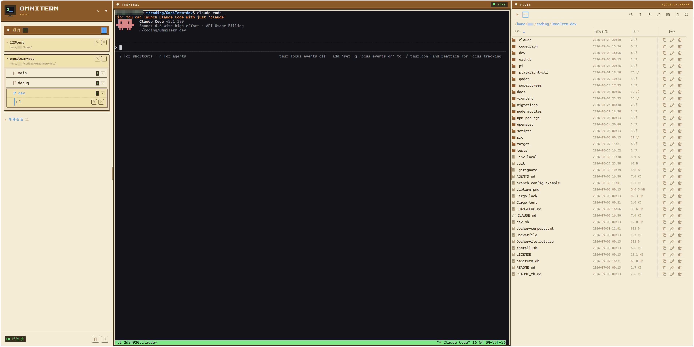

# OmniTerm

> *所有 AI 编码智能体，一个面板全掌握。*

[](LICENSE)



> [English](README.md)

## 这是什么？

AI 时代，IDE 的主体不该是一大块文本编辑器——它应该是一个观察和调度智能体的地方。OmniTerm 就是这个地方。

打开一个浏览器标签页，看到所有正在运行的 AI 编码智能体——Claude Code、Codex 等等——带有实时状态：运行中、等待输入、已完成。不用再一个个 SSH 进去切 tmux pane。内置终端和文件浏览器随时可以接管，但大多数时候你只是在看你的 agents 工作。

底层连的是 tmux。你不必关心这个。

## 特性

- **AI 智能体监控** — 识别 Claude Code、Codex 等 CLI 智能体。每个 pane 显示实时状态：运行中、等待输入、已完成。智能体需要你关注时，标签页闪烁并发出提示音。
- **文件浏览器** — 浏览、上传、下载、预览文件。13 种语言语法高亮。跟随终端当前目录。内置终端基于 xterm.js，完整键盘映射和移动端软键盘。
- **Git Worktree 感知** — 自动发现项目下所有 git worktree，按分支分组会话。终端和文件浏览器跟随选中分支。
- **单文件二进制** — Rust 后端内嵌前端与 SQLite。Shell 脚本、Cargo (git) 或 Docker 安装。一条命令启动。

## 快速开始

### 环境要求

系统需安装 tmux。安装脚本会尝试自动安装（支持 apt、brew、pacman、yum）。Docker 镜像已内置。

### 安装

```bash
# Shell 脚本
curl -fsSL https://raw.githubusercontent.com/GDWhisper/OmniTerm/main/install.sh | bash
omniterm

# Docker
docker run -d -p 9077:9077 -v omniterm-data:/app/data ghcr.io/GDWhisper/omniterm

# Cargo（从源码构建）
cargo install --git https://github.com/GDWhisper/OmniTerm
```

```bash
omniterm                 # 默认 http://localhost:9077
omniterm -p 8080         # 自定义端口
```

浏览器打开链接 → 设置初始密码 → 添加项目目录 → 智能体自动出现在侧边栏，带实时状态标记。

## 技术栈

| 层 | 技术 |
|---|------|
| 后端 | Rust + Axum + SQLite |
| 前端 | React 19 + Tailwind CSS 4 + xterm.js |
| 终端桥接 | portable-pty + WebSocket |
| 智能体检测 | tmux control mode + 内容 hook |
| 分发 | Shell 脚本、Cargo (git)、Docker |

## 参与贡献

- ⭐ 加个 Star
- 🐛 [Issues](https://github.com/GDWhisper/OmniTerm/issues) — 提交 Bug 或想法
- 📖 [English](README.md)

## 许可证

Apache-2.0 © [GDWhisper](https://github.com/GDWhisper)
